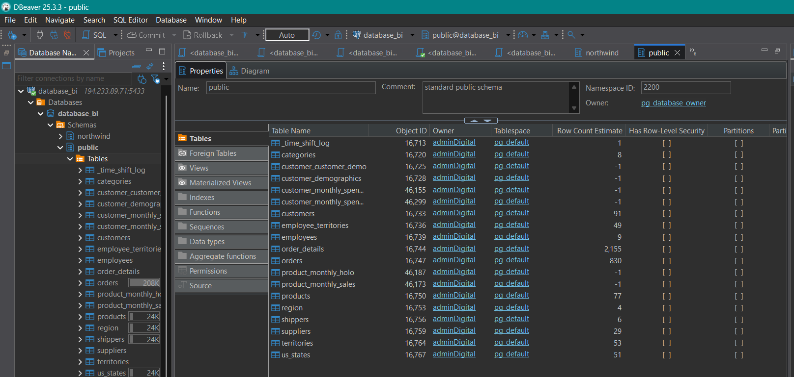
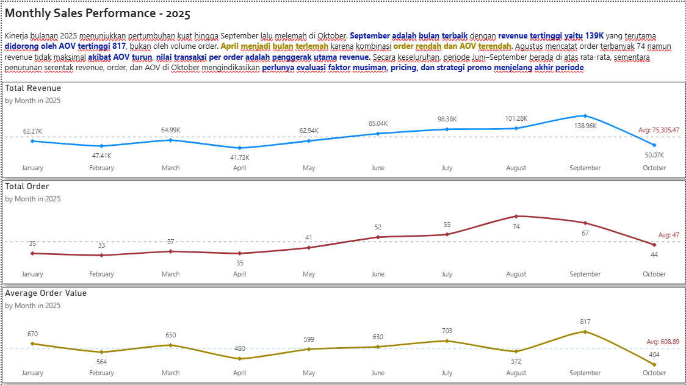
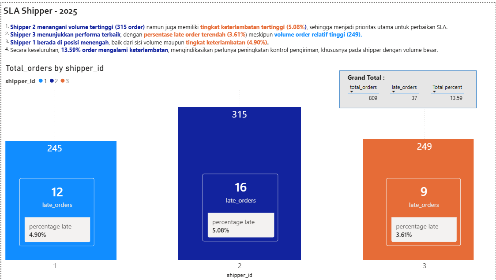
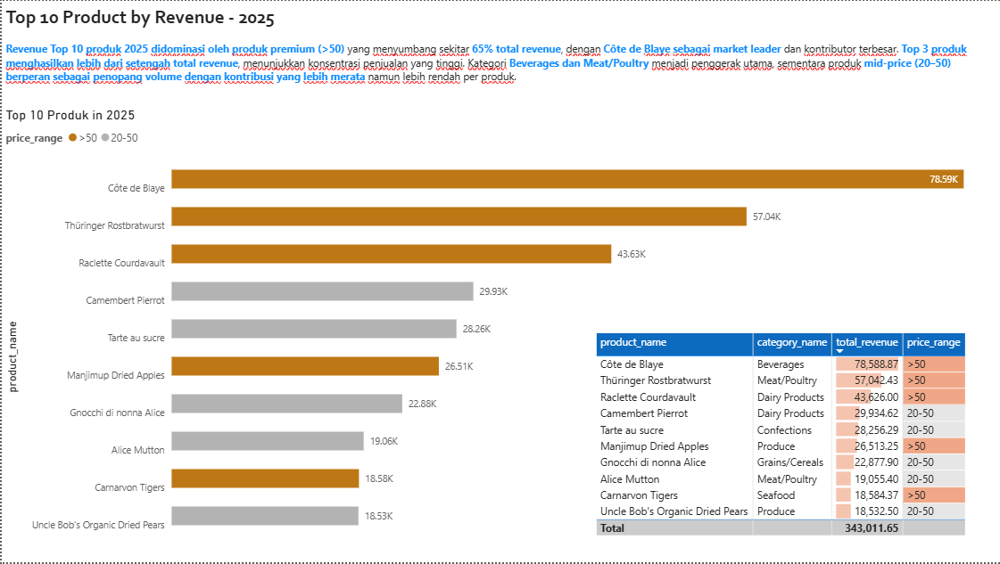
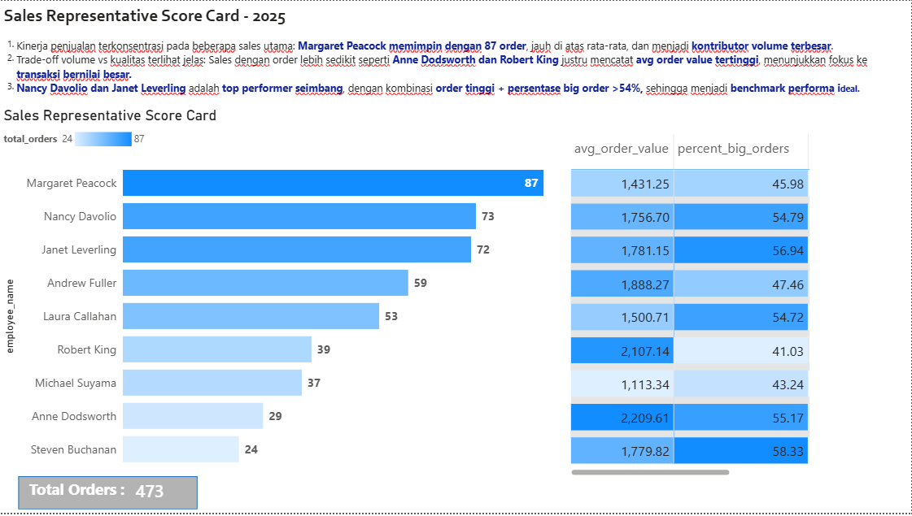
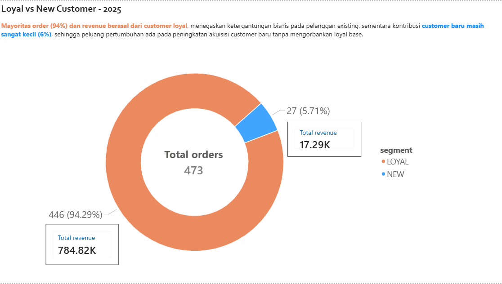

# SQL Optimatization Project and Visualization

# Tools
- Postgreeql
- Power BI

# Database overview

Database BI postgresql by digital skola :

# Latar Belakang dalam Konteks Bisnis: 
Manajemen PT X ingin brief eksekutif tahun berjalan (YTD) untuk menutup kuartal dengan 
strategi yang tepat. Mereka butuh melihat momentum penjualan bulanan, lalu mengecek 
kualitas pengiriman (SLA) agar keluhan tidak meningkat. Setelah itu, mereka ingin fokus pada 
produk yang benar-benar menyumbang pendapatan, menilai performa per sales, dan terakhir 
memahami porsi pelanggan baru vs loyal agar keputusan marketing & retensi lebih tajam. 

# Business Requirements
Ada 5 Poin yang ingin dilihat oleh management: 

1. Monthly Performance
   
        ● Tujuan bisnis: Amati momentum penjualan bulanan.
      
        ● Pertanyaan: Tampilkan jumlah order, total revenue, dan avg order value per bulan 
        (di tahun 2025). 
        
        ● Tabel: orders, order_details 
        
        ● revenue = unit_price * quantity * (1 - discount).

2. Shipper SLA (YTD)
   
        ● Tujuan bisnis: Evaluasi kurir (SLA).
   
        ● Pertanyaan: Untuk order yang sudah dikirim (YTD), tampilkan per kurir: shipped_orders, late_orders (shipped_date > required_date), dan 
        late_rate_%.
   
        ● Tabel: orders, shippers
   
3. Top 10 Products by Revenue (YTD)
   
        ● Tujuan bisnis: Fokus ke produk penyumbang pendapatan. 
        
        ● Pertanyaan: Tampilkan 10 produk ber-revenue tertinggi (YTD) beserta nama kategori dan price_range (<10, 10–20, 20–50, >50). 
        
        ● Tabel: orders, order_details, products, categories 

4. Sales Rep Scorecard (YTD)
   
        ● Tujuan bisnis: Ringkas performa per sales rep. 
        
        ● Pertanyaan: Per karyawan tampilkan jumlah order, avg order value, dan % order besar (order_total > 1000). 
        
        ● Tabel: orders, order_details, employees 

5. New vs Loyal Customers (YTD)
   
        ● Tujuan bisnis: Pahami porsi akuisisi vs retensi. 
        
        ● Pertanyaan: Segmentasi order YTD ke NEW (first order customer di tahun ini) vs LOYAL (first order sebelum tahun ini). Tampilkan orders dan revenue. 
        
        ● Tabel: orders, order_details 
        
        ● Output: segment, orders, revenue

# SQL Script

1. Monthly Performance
   
         SELECT 
             TO_CHAR(DATE_TRUNC('month', o.order_date), 'mm') AS bulan_2025,
             COUNT(DISTINCT o.order_id) AS jumlah_order,
             SUM(od.unit_price * od.quantity * (1 - od.discount)) AS total_revenue,
             AVG(od.unit_price * od.quantity * (1 - od.discount)) AS avg_order_value
         FROM orders o
         LEFT JOIN order_details od 
             ON o.order_id = od.order_id
         WHERE EXTRACT(YEAR FROM o.order_date) = 2025
         GROUP BY TO_CHAR(DATE_TRUNC('month', o.order_date), 'mm')

- 📌 Output csv : [T1_MonthlyPerformance](Output_csv/T1_Monthly_Performance.csv)
   
2. Shipper SLA (YTD)

         SELECT
             s.shipper_id,
             COUNT(*) AS total_orders,
             SUM(CASE WHEN o.shipped_date > o.required_date THEN 1 ELSE 0 END) AS late_orders,
             ROUND(
                 (SUM(CASE WHEN o.shipped_date > o.required_date THEN 1 ELSE 0 END)::numeric 
                  / COUNT(*)) * 100, 2
             ) AS late_rate_percent
         FROM orders o
         LEFT JOIN shippers s ON o.ship_via = s.shipper_id
         WHERE o.shipped_date IS NOT NULL
         GROUP BY s.shipper_id
         ORDER BY late_rate_percent DESC;

   - 📌 Output csv : [T2_SLA Shipper](Output_csv/T2_sla.ship.csv)

4. Top 10 Products by Revenue (YTD)

         with product_revenue as (	
         	select
         		od.product_id,
         		sum(od.unit_price * od.quantity * (1 - od.discount)) AS total_revenue
         	from order_details od
         	left join orders o on od.order_id = o.order_id
         	where EXTRACT(YEAR FROM o.order_date) = 2025
         	group by od.product_id
         )
         select
         	p.product_id,
         	c.category_name,
         	pr.total_revenue,
         	case 
         		when p.unit_price < 10 then '<10'
         		when p.unit_price between 10 and 20 then '10-20'
         		when p.unit_price between 20 and 50 then '20-50'
         		when p.unit_price > 50 then '>50'
         		else 'high end'
         		end as price_range
         from product_revenue pr
         left join products p on pr.product_id = p.product_id
         ;eft join categories c on p.category_id = c.category_id
         order by pr.total_revenue desc
         limit 10 ;

- 📌 Output csv : [T3_Top10Product](Output_csv/T3_top10productbyrevenue.csv)
   
5. Sales Rep Scorecard (YTD)

         WITH order_totals AS (
             SELECT 
                 o.order_id,
                 o.employee_id,
                 SUM(od.unit_price * od.quantity) AS order_total
             FROM orders o
             LEFT JOIN order_details od 
                 ON o.order_id = od.order_id
             where EXTRACT(YEAR FROM o.order_date) = 2025
             GROUP BY o.order_id, o.employee_id
         ),
         employee_summary AS (
             SELECT
                 e.employee_id,
                 e.first_name || ' ' || e.last_name AS employee_name,
                 COUNT(ot.order_id) AS total_orders,
                 AVG(ot.order_total) AS avg_order_value,
                 AVG(CASE WHEN ot.order_total > 1000 THEN 1 ELSE 0 END) * 100  AS percent_big_orders
             FROM employees e
             LEFT JOIN order_totals ot
                 ON e.employee_id = ot.employee_id
             GROUP BY e.employee_id, employee_name
         )
         SELECT *
         FROM employee_summary
         ORDER BY total_orders DESC;

- 📌 Output csv : [T4_SalesRepScorecard](Output_csv/t4_sales_res_scorecard.csv)
   
6. New vs Loyal Customers (YTD)

         WITH first_order AS (
             -- 1. Cari tanggal first order setiap customer
             SELECT 
                 customer_id,
                 MIN(order_date) AS first_order_date
             FROM orders
             GROUP BY customer_id
         ),
         ytd_orders AS (
             -- 2. Ambil semua orders YTD dan hitung revenue per order
             SELECT 
                 o.order_id,
                 o.customer_id,
                 SUM(od.unit_price * od.quantity) AS revenue
             FROM orders o
             LEFT JOIN order_details od 
                 ON o.order_id = od.order_id
             WHERE EXTRACT(YEAR FROM o.order_date) = 2025
             GROUP BY o.order_id, o.customer_id
         ),
         classified_orders AS (
             -- 3. Gabung YTD orders dengan first_order untuk menentukan segment NEW/LOYAL
             SELECT
                 yo.customer_id,
                 yo.order_id,
                 yo.revenue,
                 CASE 
                     WHEN fo.first_order_date >= DATE_TRUNC('year', current_date) THEN 'NEW'
                     ELSE 'LOYAL'
                 END AS segment
             FROM ytd_orders yo
             LEFT JOIN first_order fo
                 ON yo.customer_id = fo.customer_id

- 📌 Output csv : [T5_LoyalVSNewCustomer](Output_csv/t5_New_VS_Loyal_Customer.csv)

# Visualization
1. Monthly Performance
   
   
   
3. Shipper SLA (YTD)
   
   
   
5. Top 10 Product by Revenue (YTD)
   
   
   
7. Sales Rep Scorecard (YTD)
   
   
   
9. New vs Loyal Customers (YTD)
    
   
